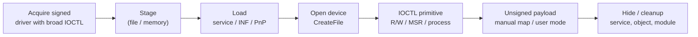
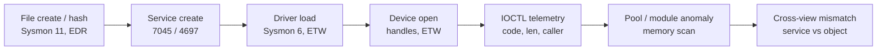
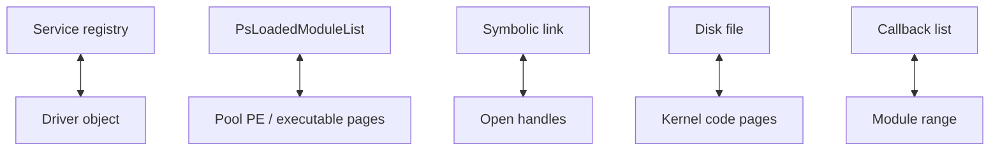

# BYOVD Flow

```mermaid
flowchart LR
    A["Acquire signed<br/>driver with broad IOCTL"] --> B["Stage<br/>(file / memory)"]
    B --> C["Load<br/>service / INF / PnP"]
    C --> D["Open device<br/>CreateFile"]
    D --> E["IOCTL primitive<br/>R/W / MSR / process"]
    E --> F["Unsigned payload<br/>manual map / user mode"]
    F --> G["Hide / cleanup<br/>service, object, module"]
```

## Telemetry overlay

```mermaid
flowchart LR
    A["File create / hash<br/>Sysmon 11, EDR"] --> B["Service create<br/>7045 / 4697"]
    B --> C["Driver load<br/>Sysmon 6, ETW"]
    C --> D["Device open<br/>handles, ETW"]
    D --> E["IOCTL telemetry<br/>code, len, caller"]
    E --> F["Pool / module anomaly<br/>memory scan"]
    F --> G["Cross-view mismatch<br/>service vs object"]
```

## Cross-view checks

```mermaid
flowchart TB
    S["Service registry"] <--> D["Driver object"]
    M["PsLoadedModuleList"] <--> P["Pool PE / executable pages"]
    L["Symbolic link"] <--> H["Open handles"]
    F["Disk file"] <--> C["Kernel code pages"]
    CB["Callback list"] <--> R["Module range"]
```
