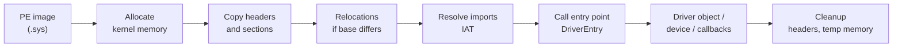
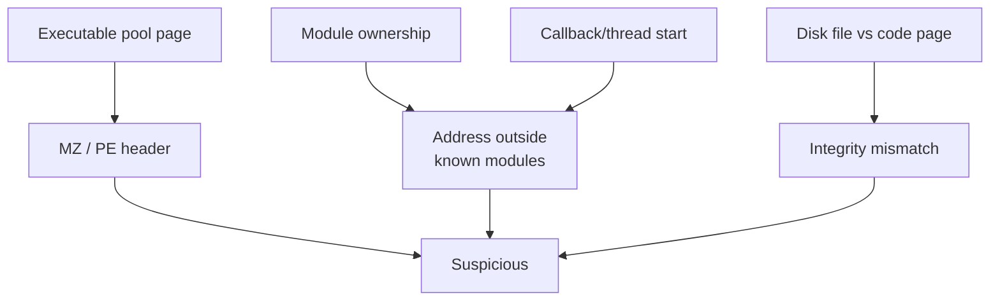

# Manual Mapping Flow (Conceptual)

> 概念图，不含 loader 实现。

```mermaid
flowchart LR
    A["PE image<br/>(.sys)"] --> B["Allocate<br/>kernel memory"]
    B --> C["Copy headers<br/>and sections"]
    C --> D["Relocations<br/>if base differs"]
    D --> E["Resolve imports<br/>IAT"]
    E --> F["Call entry point<br/>DriverEntry"]
    F --> G["Driver object /<br/>device / callbacks"]
    G --> H["Cleanup<br/>headers, temp memory"]
```

## Detection points

```mermaid
flowchart TB
    B["Executable pool page"] --> D["MZ / PE header"]
    C["Module ownership"] --> E["Address outside<br/>known modules"]
    F["Callback/thread start"] --> E
    G["Disk file vs code page"] --> H["Integrity mismatch"]
    D --> I["Suspicious"]
    E --> I
    H --> I
```

## Why it is visible

- 没有服务，但有驱动/设备对象；
- 没有模块链表项，但有可执行池；
- 没有符号链接，但已有句柄仍能 IOCTL；
- 没有磁盘文件，但代码页仍可执行。
